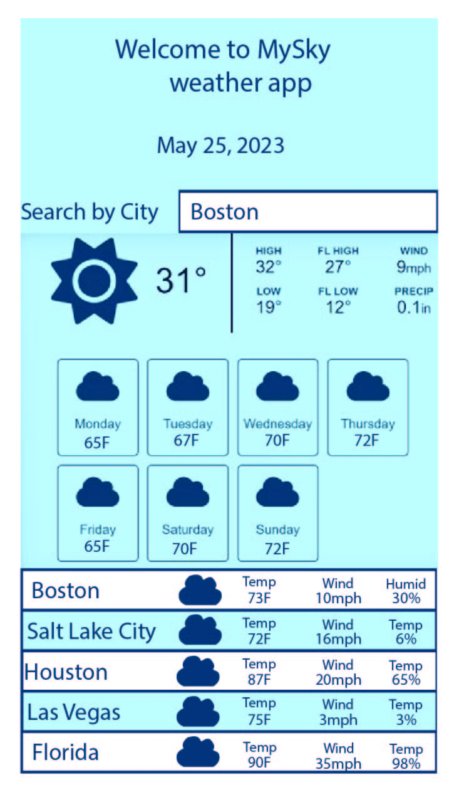

# GetMyWeather 

Git Link:
https://anna071387.github.io/GetMyWeather/

## Description 
This is a weather app that allow to search for any city and discover what weather is currently in that city. 
&Day forecast provided

## Use 
The added search button allows to connect data for any particular city and represent the today temperature, 
see the icon for what type of weather is, wind speed, humidity.

Search button allow for easy search and searched cities are stored at the bottom of the forecast 
with all the information available to view at glance. 

# Results
During the creation of the app I have learnt how to fetch API from the weather source (rest API). 
I have learnt how to access arrays to retrieve information that I want to represent on my website/app.
I applied styling methods to create visual features. 
DayJs methods for date retrieval

Inspiration: 
Web Dev Simplified: Weather app

